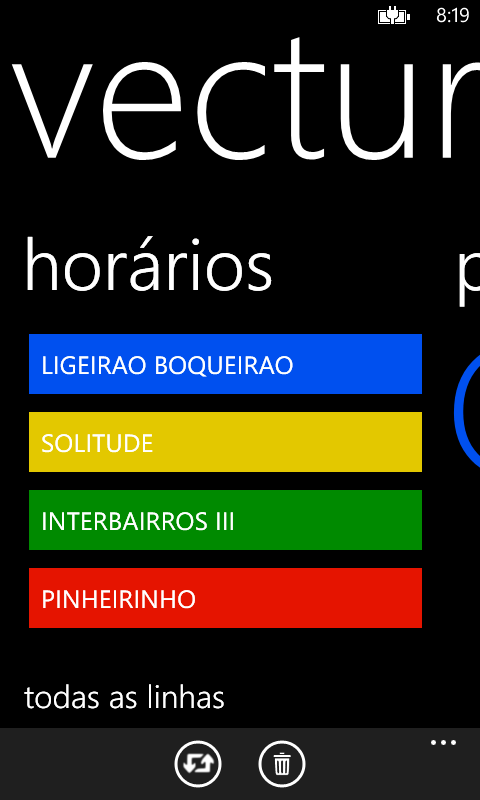
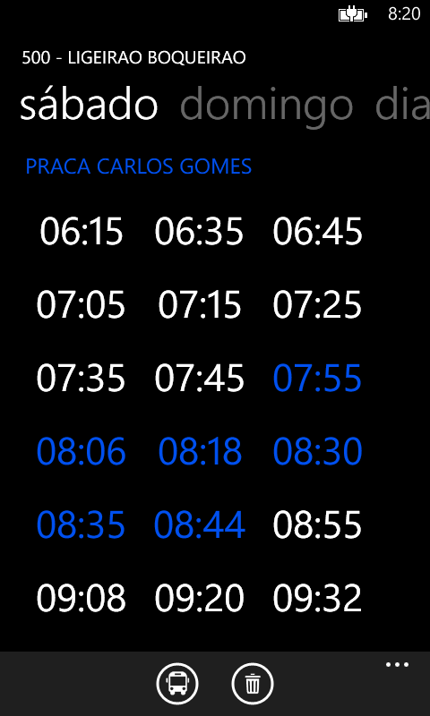
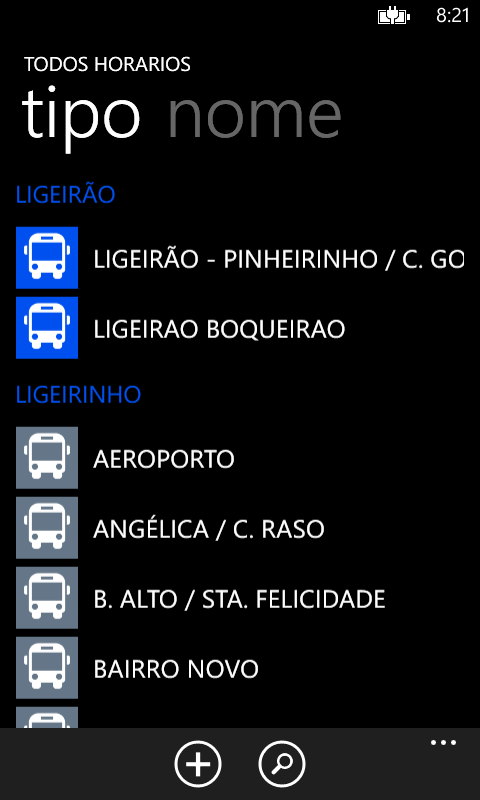
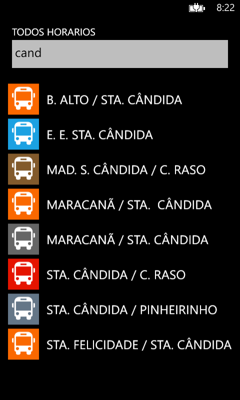
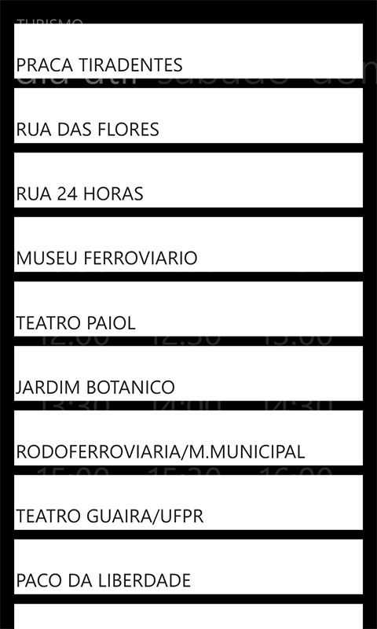
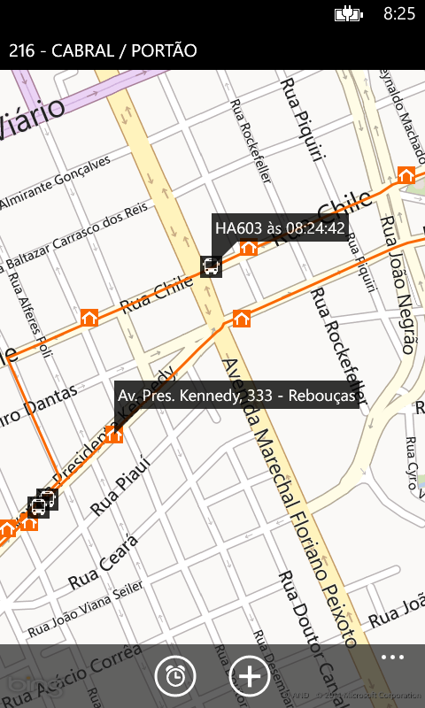

# Vectura - Ônibus Curitiba

App Windows Phone com informações do transporte coletivo de Curitiba. 
Oferece dados em tempo real de horários e itinerários.

  Funcionalidades:
  <ul>
    <li>Cadastro de linhas favoritas;</li>
    <li>Página de horários por dia da semana;</li>
    <li>Agrupamento de linhas semelhantes;</li>
    <li>Busca por linhas;</li>
    <li>Mapa com itinerários e geolocalização dos veículos;</li>
    <li>Interface simples e limpa.</li>
  </ul>

 

  
  
  
  
  
  

  <i>Desenvolvido por Rodrigo Chin. 2013</i>

